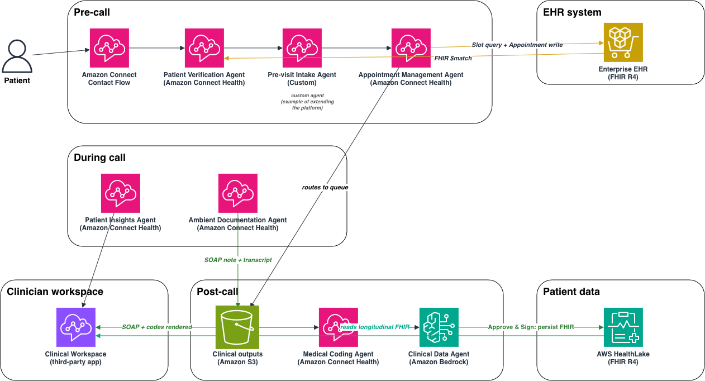

# Architecture Overview

This sample implements a unified clinical workflow for telehealth on Amazon
Connect Health, from pre-call intake through post-call clinical documentation
and write-back to a FHIR store.

It is a **reference implementation**, not a turnkey clone. Some components are
generally available and run as-is, some require Amazon Connect Health
enablement, and a built-in **local demo mode** replays the full journey with
synthetic data and no AWS account. See `capability-matrix.md` for what runs
where and `deployment.md` for the path to a live deployment.

All patients, identifiers, and clinical content in this repository are
synthetic and do not represent real people or real FHIR resources.

## Accounts and data stores

Single AWS account. The workflow touches two FHIR R4 surfaces:

- **Enterprise EHR (external)** — the customer's system of record. Pre-call
  agents query appointment slots and run patient `$match` against it. This is a
  customer integration prerequisite, not something the sample provisions.
- **Amazon HealthLake (in-account)** — the longitudinal point-of-care store.
  Post-call clinical outputs are persisted here after clinician sign-off, and
  population-health queries read from it. In this sample, load HealthLake with
  synthetic Synthea FHIR data.

## Components

- **Amazon Connect** (telephony) + **Contact Flow** — routes the patient call.
- **Java bridge (ECS)** — streams call audio (via Kinesis Video Streams) to the
  ambient documentation agent.
- **Amazon Connect Health domain** — hosts the point-of-care agents (below).
- **Backend API (Flask / ECS)** — orchestrates the agents, HealthLake, S3, and
  Bedrock via the SDK, and serves the clinician workspace.
- **Amazon Bedrock** — the custom Pre-visit Intake agent (extensibility example)
  and the Clinical Data agent (structured extraction for write-back).
- **fhir-query Lambda** — the Care Intelligence action group; runs FHIR queries
  against the in-account HealthLake datastore.
- **Amazon S3** — clinical outputs (SOAP notes, medical codes, streaming output).
- **Clinician workspace** — renders insights, SOAP notes, and codes; the
  clinician reviews, then Approves & Signs.

## Agent landscape

Native Amazon Connect Health agents (domain-scoped):

1. **Patient Verification** — `$match` against the EHR. GA; requires EHR integration.
2. **Appointment Management** — slot query + appointment write to the EHR. Preview.
3. **Patient Insights** — reads FHIR from HealthLake, generates a pre-visit narrative. Preview.
4. **Ambient Documentation (Medical Scribe)** — listens to live audio via the bridge, generates a SOAP note. GA.
5. **Medical Coding** — reads the SOAP note, generates ICD-10 / CPT codes with evidence. Gated preview.

Custom Bedrock agents (built in this sample — the extensibility pattern):

- **Pre-visit Intake agent** — worked example of extending the platform with your
  own agent and tool (AgentCore gateway -> Lambda). Captures the patient's stated
  reason for the visit. It does not assess symptoms, assign urgency, give advice,
  or route the encounter.
- **Clinical Data agent** — on Approve & Sign, extracts structured Medications,
  Allergies, Observations, and Conditions for FHIR write-back.

**Note on Patient Verification:** it is a genuine GA Connect Health capability
and depends on EHR integration. Because enabling it requires an integrated EHR,
the local demo represents verification within the pre-call flow rather than
invoking the live agent. See `capability-matrix.md`.

## End-to-end flow

- **Pre-call:** patient calls -> Contact Flow -> Patient Verification (`$match`
  against EHR). On a scheduling call, Appointment Management queries slots and
  writes the booking to the EHR. For a returning patient whose appointment is
  already on file, the flow goes straight to Pre-visit Intake (custom), which
  captures the stated reason for the visit. Either way the contact is then routed
  to a queue; nothing routes on the Pre-visit Intake output.
- **During call:** audio -> bridge -> Patient Insights (pre-visit narrative) +
  Ambient Documentation (SOAP note + transcript).
- **Post-call:** SOAP + transcript -> S3 -> Medical Coding (ICD-10 / CPT) ->
  Clinical Data agent (structured extraction) -> clinician reviews in the
  workspace -> Approve & Sign -> persist FHIR (Encounter, DocumentReference,
  Conditions, Medications, Allergies, Observations) to HealthLake.
- **Care Intelligence:** clinician asks population-health questions -> Bedrock
  agent -> fhir-query Lambda -> HealthLake.

## Same-account requirement

The native Connect Health agents operate against a HealthLake datastore in the
**same account** as the domain that invokes them. Keep the domain and the
datastore in one account.

## What runs where

See `capability-matrix.md` (real / demo-simulated / gated, per step) and
`deployment.md` (local demo -> wire the GA pieces -> wire the gated pieces).
